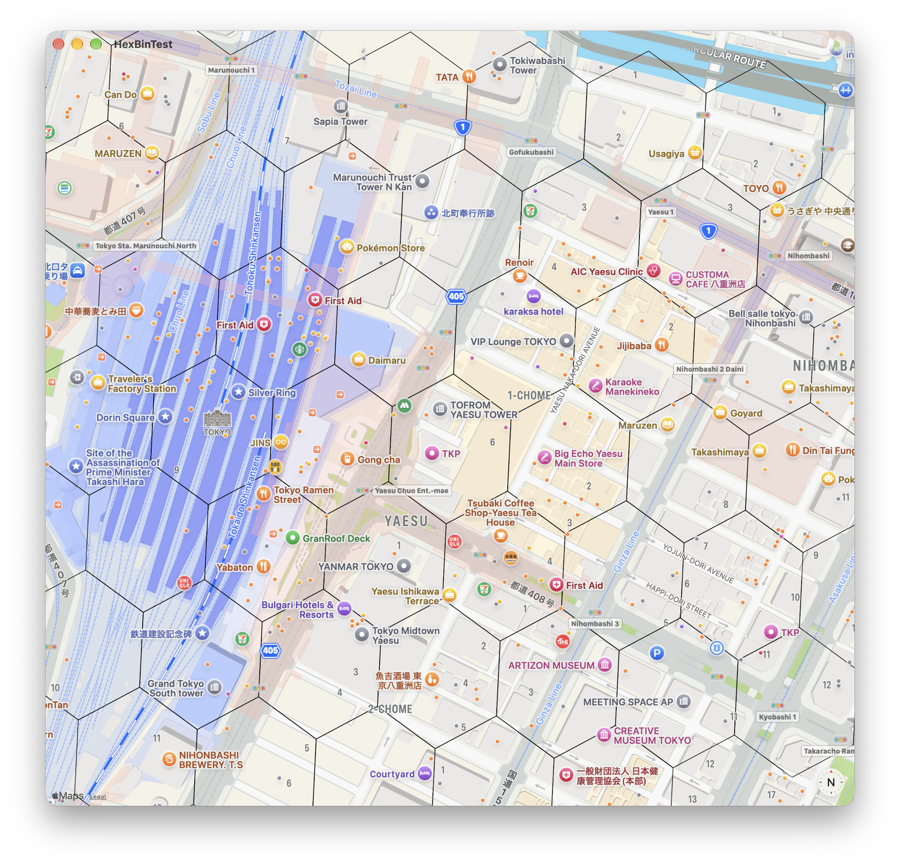
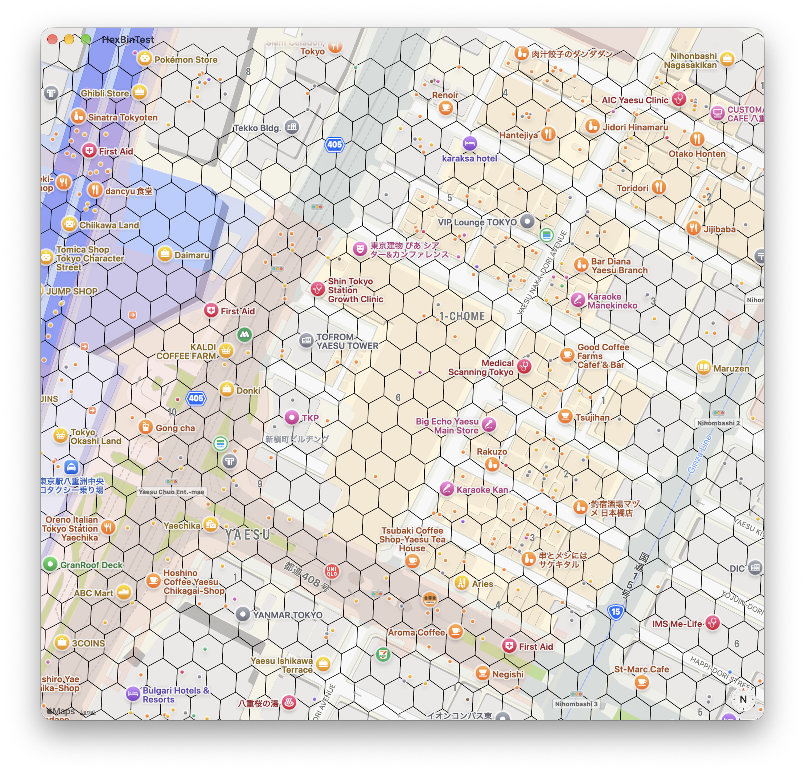

#  HexBinTest
SwiftUI Map test of Uber H3. 
Testing Uber [H3](https://github.com/uber/h3) "A Hexagonal Hierarchical Geospatial Indexing System"
and the [SwiftyH3](https://github.com/pawelmajcher/SwiftyH3) "The Swifty way to use [Uber's H3 geospatial indexing system](https://h3geo.org/)"  

## Screenshots

   
   

